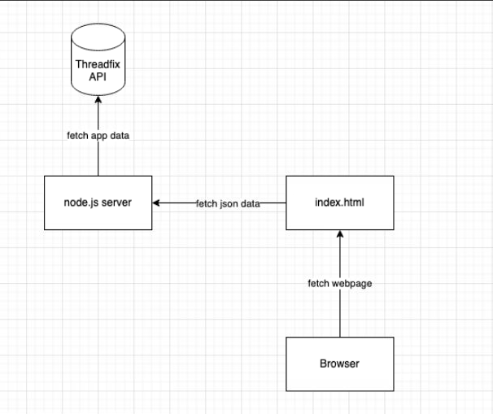

# Threadfix_Heatmap_Visualization

Simple heatmap visualization of Threadfix security data inside a web page, using the apexcharts library.

## Development

Create a file called `config.js` with the following content:

```
exports.THREADFIX_APIKEY = '$THREADFIX_APIKEY'
exports.THREADFIX_BASEURL = '$THREADFIX_BASEURL'
```

Get the values of `$THREADFIX_APIKEY` and `$THREADFIX_BASEURL` from your running Threadfix installation.

Then start the node.js server and serve the index.html file:

```
# Start the node.js server on port 9876
$ npm install
$ node backend/server.js &

# Serve the index.html on port 8000
python3 -m http.server  8000
```

## Architecture

A simple node.js service will fetch the data for all applications via Threadfix API and implements a simple JSON file based caching logic. When a browser fetches the html, a GET request is sent to the node.js service to get the JSON data. A little bit of JavaScript will then prepare the data for rendering the heatmap using the "apexcharts" library.


